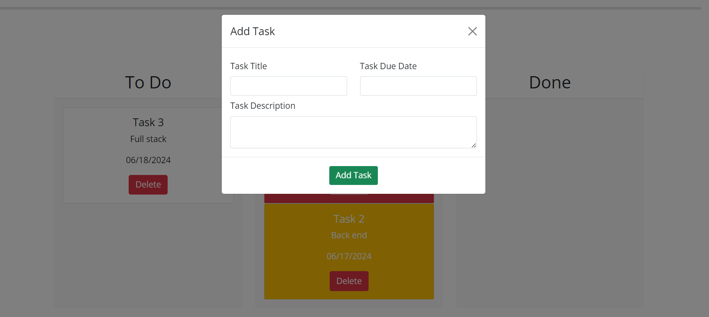
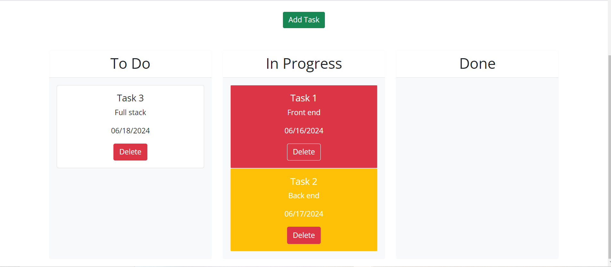
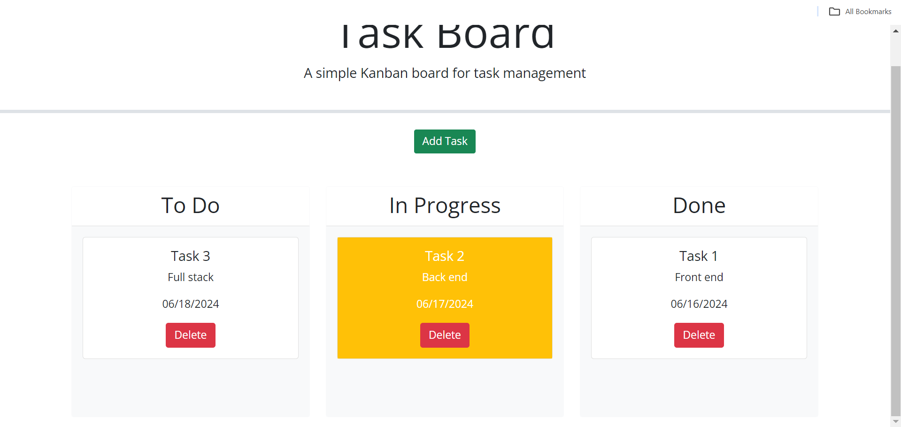
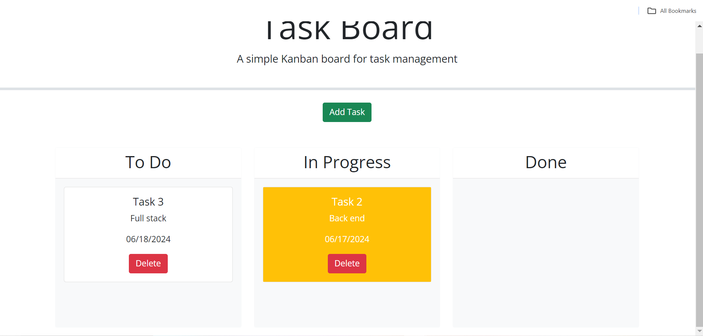

# Task Board

## Description

This webpage allows a user to create a task board and move tasks to the appropriate status lane.

## Usage

To use this webpage, click 'Add Task' , fill out the title, due date, and description sections, then click the Add Task button. A task card will then be created and displayed in the to-do lane. The task card will either be white, meaning the task is due in the future, yellow, meaning the task is due today, or red, meaning the task is overdue. You can drag the tasks to the appropriate lane, where they will turn white when done. You can also click the delete button to remove the task.

[Deployed Application](https://kimiko-dixon.github.io/Task_Board/)

## Credits

Tutor: lines 153-161

## License

LICENSE in repo.